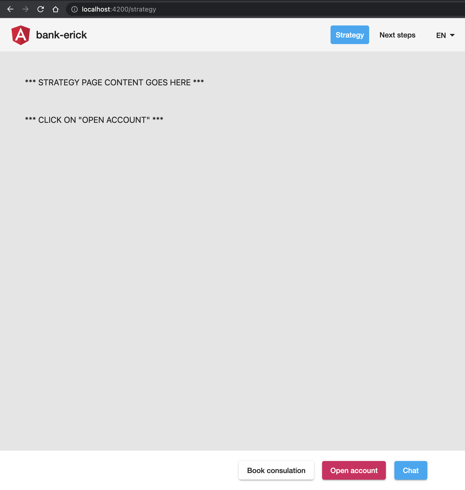
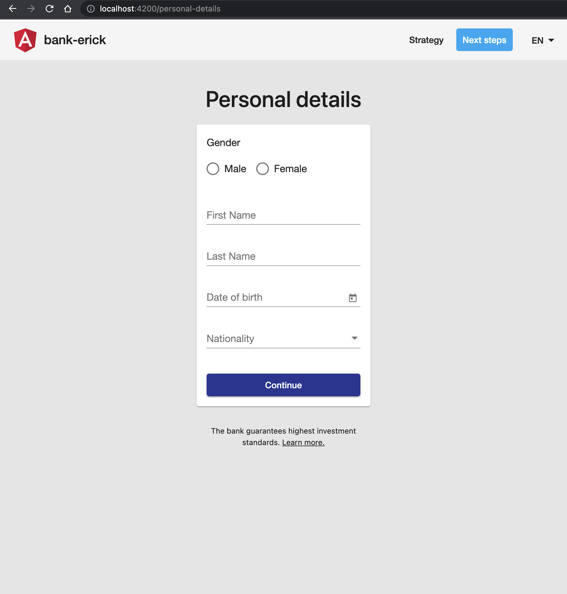
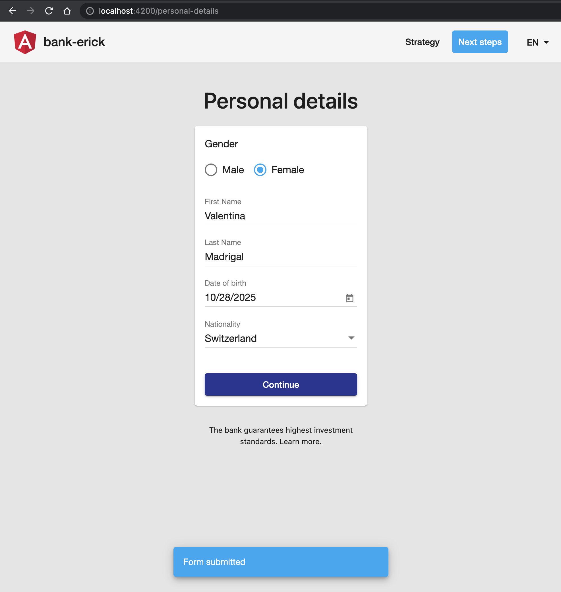
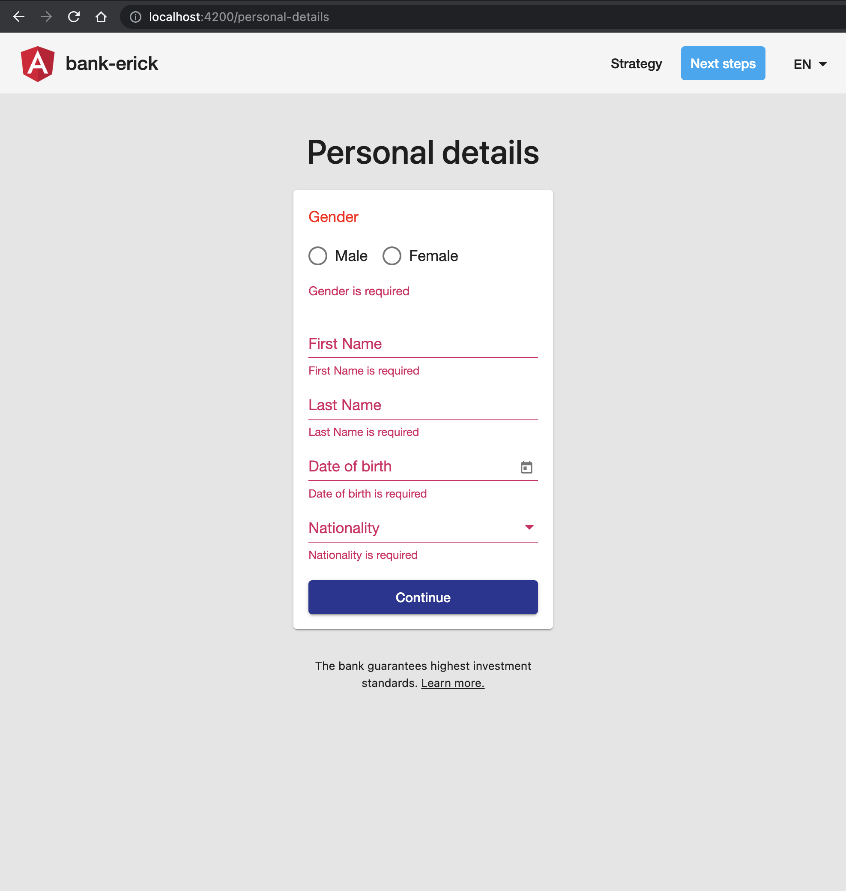
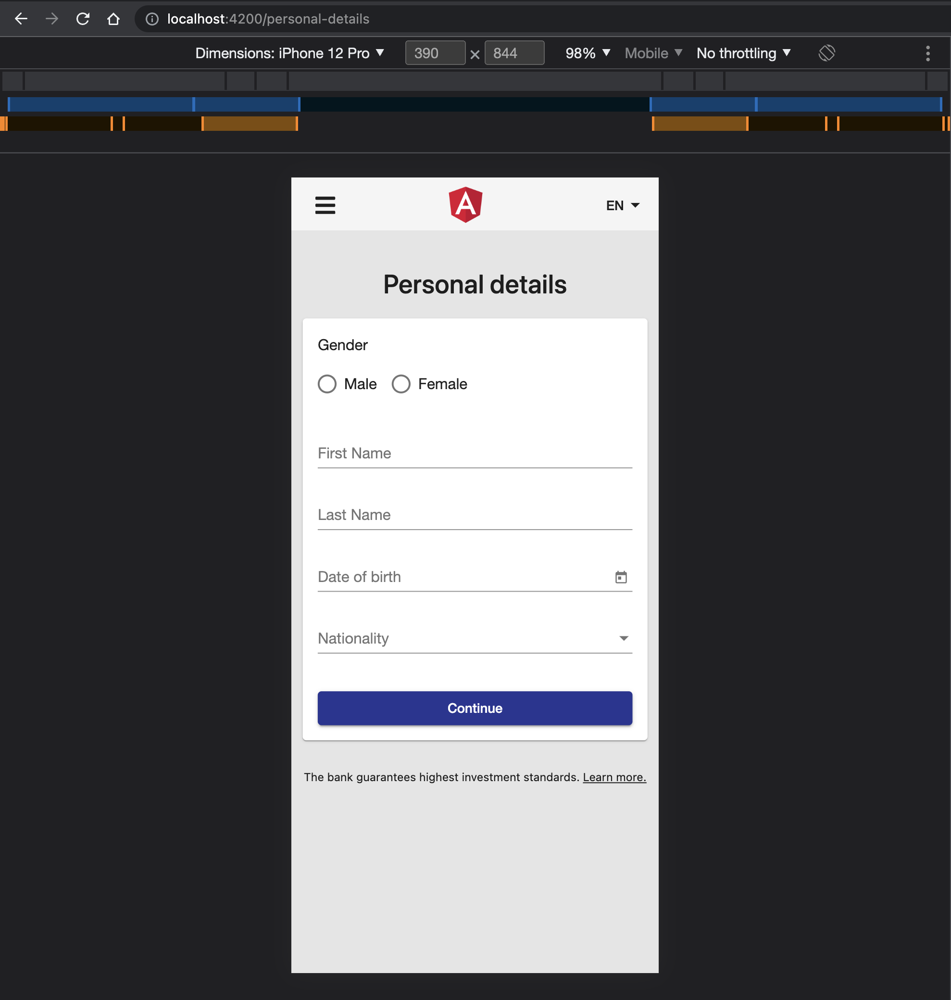

# bank-erick

This repo showcase an example investing bank application, where the product team would like to implement a new feature for its web app: a new customer onboarding process. Every user of the app should see the personal details screen, which is the first step of the entire customer onboarding process.

## Table of Content

- Live Demo at: [https://ebastidas-probable-adventure-7g6pvrv5rg2xxqj-4200.preview.app.github.dev/](https://ebastidas-probable-adventure-7g6pvrv5rg2xxqj-4200.preview.app.github.dev/)

## Getting started

```bash
git clone https://github.com/ebastidas/bank-erick.git
cd bank-erick
npm install
npm start
```

## Demo screenshots

base-page-strategy:



personal-details-page:



personal-details-page-form-submitted:



personal-details-page-form-error:



personal-details-page-mobile-view:



## Useful Commands

- `npm start` - starts a dev server and opens browser with running app
- `npm run start:prod` - runs full prod build and serves prod bundle
- `npm run test` - runs lint and tests
- `npm run watch` - runs tests in watch mode
- `npm run format:write` - runs prettier to format whole code base (`.ts` and `.scss`)

## Goals

The main goal of this repository is to provide an up to date example of Angular application following all recent best practices in various areas like:

- `@ngrx/store` - including reducers, actions, selectors
- `@ngrx/effects` - for implementation of side effects like `http` requests, logging, notifications,...
- `@ngrx/entity` - for CRUD operations
- `@ngrx/router-store` - to connect the Angular Router to @ngrx/store
- `@ngrx/store-devtools` - to enable a powerful time-travelling debugger.
- `@angular/material` - material design component library, theming, ...
- routing
- testing of all the above mentioned concepts
- Angular CLI configuration (prod build, budgets, ...)

## Features

- custom themes support (4 themes included)
- lazy-loading of feature modules
- lazy reducers
- localStorage ui state persistence
- fully responsive design
- angular-material and custom components in `SharedModule`

## Stack

- Angular
- NgRx
- Angular Material
- Bootstrap 5 (only reset, utils and grids)
